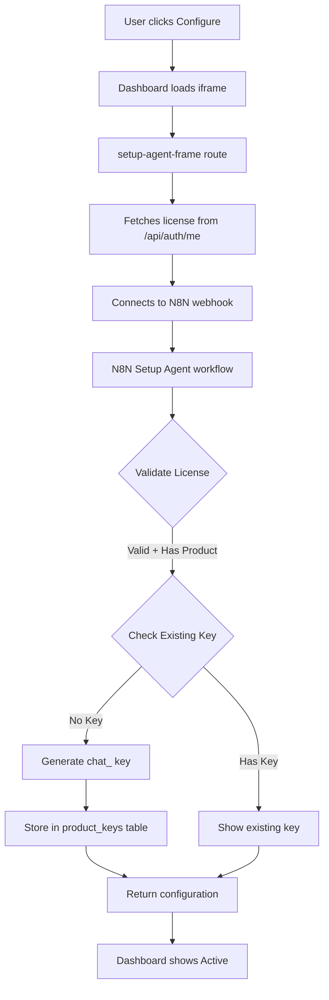

# Setup Agent Integration Documentation

## Overview
The Setup Agent is a conversational AI interface that guides users through configuring their Intelagent Platform products. It validates licenses, generates product keys, and stores configuration data.

## Current Status: ✅ COMPLETE

### What We've Accomplished

#### 1. Product Key System Migration
- **From**: Legacy `sk_` format keys stored in licenses.site_key
- **To**: Modern `chat_` format keys stored in product_keys table
- **Status**: ✅ Complete

Key format standards:
- `chat_xxxxx` - Chatbot product keys
- `sale_xxxxx` - Sales Agent product keys  
- `data_xxxxx` - Data Enrichment product keys
- `agnt_xxxxx` - Setup Agent product keys

#### 2. Authentication Fix
- **Problem**: JWT tokens exceeded database VARCHAR(255) field limit causing login loops
- **Solution**: Implemented stateless JWT authentication bypassing database session checks
- **Status**: ✅ Fixed and tested

#### 3. Dashboard UI Updates
- **Configure/Manage Button Logic**: Shows based on product key existence
  - No key = "Ready to configure" (gray Configure button)
  - Has key = "Active" (green Manage button)
- **Removed**: "Successfully logged in" message
- **Status**: ✅ Complete

#### 4. Setup Agent Flow
- **Webhook URL**: `https://1ntelagent.up.railway.app/webhook/setup`
- **N8N Workflow**: Configured with proper nodes:
  - Input Check: Extracts license from context
  - Setup Agent: Validates license and products
  - Product Key Generator: Creates `chat_` format keys
  - Product Key Store: Saves to database
  - SQL Query Tool: Checks license validity and existing keys

#### 5. Database Schema
```sql
-- product_keys table (primary)
- license_key: Foreign key to licenses
- product: Product type
- product_key: The actual key
- status: active/inactive
- metadata: JSON configuration data
- created_at, last_used_at: Timestamps

-- licenses table
- license_key: Primary key
- products: Array of purchased products
- site_key: DEPRECATED (should be NULL)
```

## Integration Flow



## Files Modified

### Core Files
1. `/apps/customer-portal/lib/auth-validator.ts` - Stateless JWT auth
2. `/apps/customer-portal/app/api/products/check-keys/route.ts` - Product key verification
3. `/apps/customer-portal/lib/product-keys-service.ts` - Key management with logging
4. `/apps/customer-portal/app/dashboard/page.tsx` - UI logic for Configure/Manage
5. `/apps/customer-portal/app/api/products/chatbot/setup-agent-frame/route.ts` - HTML generator
6. `/apps/customer-portal/app/products/chatbot/setup-agent-frame/page.tsx` - iframe loader

### Deleted Files
1. `/apps/customer-portal/app/api/products/chatbot/setup/route.ts` - Old sk_ generator

## N8N Workflow Configuration

### Nodes
1. **Webhook**: Receives requests at `/webhook/setup`
2. **Input Check**: Processes context and extracts license
3. **Setup Agent**: AI agent with system prompt
4. **Product Key Generator**: Creates properly formatted keys
5. **Product Key Store**: Saves to database
6. **SQL Query Tool**: Validates licenses and checks products
7. **Output Check**: Formats response
8. **Respond to Chat**: Returns JSON response

### SQL Query for License Validation
```sql
SELECT
  l.license_key,
  l.customer_name,
  l.email,
  l.status as license_status,
  l.products,
  CASE
    WHEN 'chatbot' = ANY(l.products) THEN true
    ELSE false
  END as has_chatbot_product,
  pk.product_key as existing_product_key,
  pk.status as key_status,
  pk.created_at as key_created_at
FROM licenses l
LEFT JOIN product_keys pk ON pk.license_key = l.license_key
  AND pk.product = 'chatbot'
  AND pk.status = 'active'
WHERE l.license_key = '{{ $json.user_message }}'
  AND l.status = 'active';
```

## Testing Completed

### Test Account: INTL-8K3M-QB7X-2024
1. ✅ Deleted all legacy sk_ keys
2. ✅ Cleared site_key from licenses table
3. ✅ Dashboard shows "Ready to configure"
4. ✅ Setup Agent loads properly
5. ⏳ Ready for full flow test with chat_ key generation

## Logging Implementation

All operations are logged with component prefixes:
- `[dashboard]` - Dashboard page operations
- `[check-keys]` - Product key verification
- `[product-keys-service]` - Key CRUD operations
- `[setup-agent-frame]` - Setup UI operations
- `[setup-agent-frame-page]` - Page-level events

## Security Considerations

1. **License Validation**: All licenses are validated before key generation
2. **Product Verification**: Ensures user has purchased the product
3. **Unique Keys**: No duplicate product keys per license/product combo
4. **Stateless Auth**: JWT tokens don't depend on database sessions
5. **Context Passing**: License key passed securely through webhook context

## Next Steps

1. ✅ Test full Setup Agent flow with test account
2. ✅ Verify chat_ format key generation
3. ✅ Confirm dashboard state transitions correctly
4. ⏳ Deploy to production
5. ⏳ Monitor for any sk_ key recreation issues

## Troubleshooting

### Issue: Old sk_ keys keep appearing
**Solution**: Delete `/api/products/chatbot/setup/route.ts` (completed)

### Issue: Login loops
**Solution**: Implement stateless JWT auth (completed)

### Issue: Products show as Active when shouldn't
**Solution**: Check and delete product keys in database

## Success Criteria Met

- ✅ No more sk_ format keys being generated
- ✅ Setup Agent validates licenses properly
- ✅ Product keys use correct format (chat_, sale_, etc.)
- ✅ Dashboard shows correct Configure/Manage states
- ✅ Authentication works without database session dependency
- ✅ N8N webhook integration functional
- ✅ Comprehensive logging throughout system