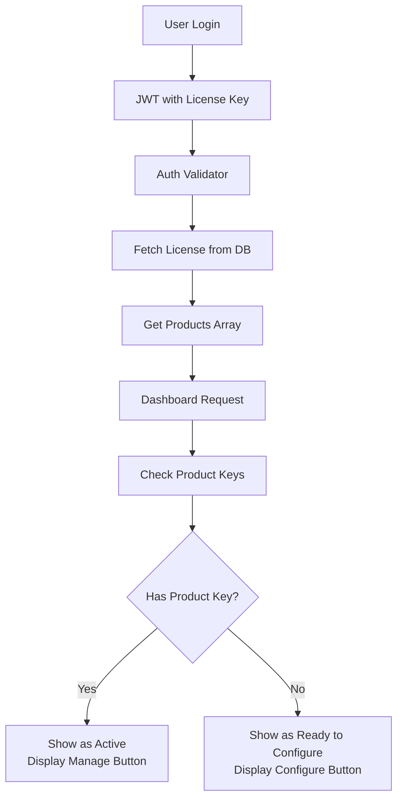

# Universal Product Configuration System

## Overview
The platform uses a universal configuration system that works consistently across all license keys and products. This document describes how the system works and ensures every user sees their products at the correct configuration stage.

## System Architecture

### 1. Product Access Control
Products are defined at the license level in the `licenses` table:
- Each license has a `products` array field
- Products available: `chatbot`, `sales-agent`, `data-enrichment`, `setup-agent`
- Users only see and can configure products included in their license

### 2. Configuration State Management
Product configuration state is tracked in the `product_keys` table:
- Each configured product has an entry with a unique product key
- Product keys use prefixes: `chat_`, `sale_`, `data_`, `agnt_`
- No product key = Not configured (shows "Configure" button)
- Has product key = Configured (shows "Manage" button)

### 3. Universal Flow



## Key Components

### Authentication (`/lib/auth-validator.ts`)
- Fetches license information including products array
- Returns consistent user object with their available products
- No hardcoded products or special cases

### Product Status Check (`/api/products/check-keys`)
```javascript
for (const product of userProducts) {
  const productKey = await getProductKey(licenseKey, product);
  const hasKey = !!productKey;
  
  productStatus[product] = {
    configured: hasKey,
    hasProductKey: hasKey,
    canManage: hasKey,
    canConfigure: !hasKey
  };
}
```

### Dashboard Display (`/app/dashboard/page.tsx`)
- Gets products from authenticated user's license
- Checks configuration status for each product
- Routes to appropriate page based on status:
  - Not configured → `/products/{product}/setup`
  - Configured → `/products/{product}/manage`

### Product Configuration (`/components/products/ProductConfigurator.tsx`)
Universal component supporting all products with:
- Customizable fields per product type
- Password-based authentication (no license key exposure)
- Instant product key generation
- Embed code generation

### Configuration API (`/api/products/configure`)
Single endpoint handling all product configurations:
- Validates license and product access
- Generates product-specific keys
- Stores configuration metadata
- Prevents duplicate configurations

## Product-Specific Configuration

### Chatbot
- **Fields**: Domain (website URL)
- **Key Prefix**: `chat_`
- **Embed**: JavaScript snippet for website integration

### Sales Agent
- **Fields**: Domain, Industry, Target Audience
- **Key Prefix**: `sale_`
- **Embed**: JavaScript snippet for sales automation

### Data Enrichment
- **Fields**: API Endpoint, Data Sources, Refresh Rate
- **Key Prefix**: `data_`
- **Embed**: API credentials and endpoint

### Setup Agent
- **Fields**: Company Name, Onboarding Steps
- **Key Prefix**: `agnt_`
- **Embed**: JavaScript snippet for onboarding automation

## Security Features

1. **Password Authentication**: All configurations require password verification
2. **No License Key Exposure**: License keys never sent to client
3. **Domain Ownership**: Prevents duplicate domain configurations
4. **JWT-Based Sessions**: Stateless authentication
5. **Product Access Control**: Users can only configure products in their license

## Database Schema

### Licenses Table
```sql
licenses {
  license_key: string (primary key)
  products: text[] -- Array of product identifiers
  email: string
  status: string -- 'active', 'suspended', etc.
}
```

### Product Keys Table
```sql
product_keys {
  id: uuid (primary key)
  license_key: string (foreign key)
  product: string -- 'chatbot', 'sales-agent', etc.
  product_key: string (unique)
  status: string -- 'active', 'inactive'
  metadata: jsonb -- Configuration details
}
```

## Migration from Legacy System

### Removed Features
- ❌ Legacy `site_key` field fallback
- ❌ Conversational Setup Agent
- ❌ N8N webhook dependencies
- ❌ Hardcoded product lists

### New Features
- ✅ Universal form-based configuration
- ✅ Product-specific management pages
- ✅ Consistent status detection
- ✅ Password-based security

## Testing Product Status

To verify a license's product status:

```sql
-- Check what products a license has and their configuration status
SELECT 
  l.license_key,
  l.products as available_products,
  array_agg(pk.product) as configured_products
FROM licenses l
LEFT JOIN product_keys pk ON l.license_key = pk.license_key
WHERE l.license_key = 'YOUR_LICENSE_KEY'
GROUP BY l.license_key, l.products;
```

## API Endpoints

### Check Product Configuration Status
```
GET /api/products/check-keys
Authorization: Required

Response:
{
  "success": true,
  "configurations": {
    "chatbot": {
      "configured": false,
      "hasProductKey": false,
      "canManage": false,
      "canConfigure": true
    }
  }
}
```

### Configure Product
```
POST /api/products/configure
{
  "product": "chatbot",
  "password": "user_password",
  "configuration": {
    "domain": "example.com"
  }
}

Response:
{
  "success": true,
  "product_key": "chat_abc123...",
  "embed_code": "<script>...</script>"
}
```

## Troubleshooting

### Products showing wrong status?
1. Check the license has the product: `SELECT products FROM licenses WHERE license_key = ?`
2. Check for product keys: `SELECT * FROM product_keys WHERE license_key = ?`
3. Clear browser cache and cookies
4. Check console logs in dashboard

### Configuration not saving?
1. Verify password is correct
2. Check license is active
3. Ensure product is in license.products array
4. Check for existing configuration for same domain

## Best Practices

1. **Always use the ProductConfigurator component** for new products
2. **Never expose license keys** in client-side code
3. **Check product access** before allowing configuration
4. **Use consistent key prefixes** for new products
5. **Store configuration metadata** for debugging

## Future Enhancements

- [ ] Bulk product configuration
- [ ] Configuration templates
- [ ] API key rotation
- [ ] Usage analytics per product
- [ ] Team member access control

---

Last Updated: January 2025
System Version: 2.0 (Universal Configuration)